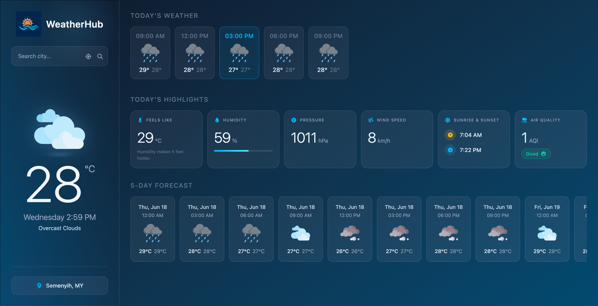
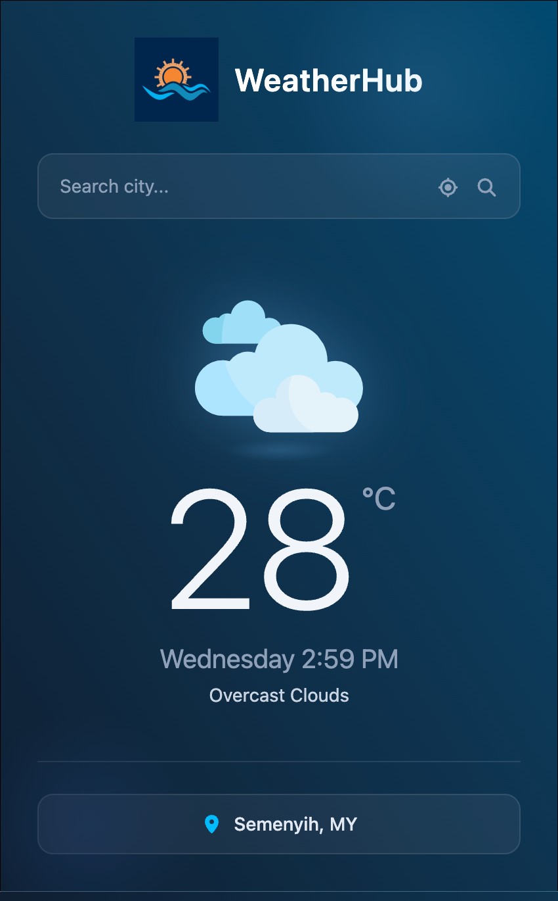
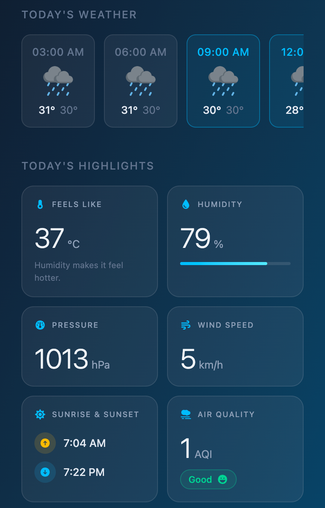
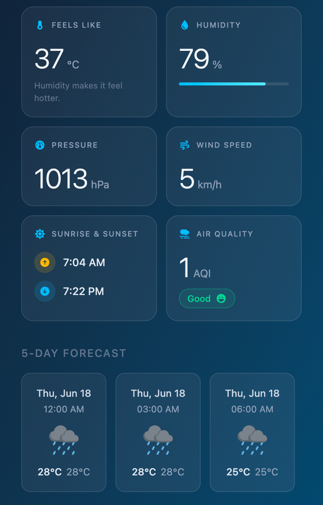

# Weather App


> A simple, responsive weather application that delivers current weather updates, 5-hourly forecasts, and multi-day outlooks — powered by the OpenWeather API.

---

## Table of Contents

- [Overview](#overview)
- [Features](#features)
- [Screenshots](#screenshots)
- [Technologies Used](#technologies-used)
- [Prerequisites](#prerequisites)
- [Installation](#installation)
- [Configuration](#configuration)
- [Usage](#usage)
- [License](#license)

---

## Overview

This weather app is designed to provide accurate and up-to-date weather information, helping users stay informed about conditions at their current location or any location worldwide. The app is fully responsive and optimised for both web and mobile experiences.

---

## Features

| Feature | Description |
|---|---|
| 🌡️ Current Weather | Current temperature, humidity, wind speed, and conditions |
| ⏱️ 3-Hourly Forecast | Weather breakdown in 3-hour intervals for the current day |
| 📅 Multi-Day Outlook | Weather forecast spanning the next 5 days |
| 📍 Auto Location | Automatically detects and displays local weather |
| 🔍 Global Search | Search for weather information for any location worldwide |

---

## Screenshots

### Web

| Home / Dashboard |
|---|
|  |

---

### Mobile

| Current Weather | Today's Weather & Highlights | 5-day Forecast |
|---|---|---|
|  |  |  |

---

## Technologies Used

| Technology | Version | Purpose |
|---|---|---|
| [Vite](https://vitejs.dev/) | 8.x | Build tool and dev server |
| [React](https://react.dev/) | 19.x | UI framework |
| [Tailwind CSS](https://tailwindcss.com/) | 4.x | Utility-first styling |
| [OpenWeather API](https://openweathermap.org/api) | 2.5 | Weather data provider |
| HTML5 / CSS3 | — | Markup and base styling |

---

## Prerequisites

Before getting started, ensure you have the following installed:

- **Node.js** v18 or higher
- **npm** v9 or higher
- An active **OpenWeather API** key — [register here](https://openweathermap.org/)

---

## Installation

1. **Clone the repository**

```bash
   git clone https://github.com/your-org/weather-app.git
   cd weather-app
```

2. **Install dependencies**

```bash
   npm install
```

3. **Configure environment variables** *(see [Configuration](#configuration) below)*

4. **Start the development server**

```bash
   npx vite
```

   The app will be available at `http://localhost:5173` by default.

---

## Configuration

Create a `.env` file in the project root and add your OpenWeather API key:

```env
VITE_OPENWEATHER_API_KEY=your_api_key_here
```

---

## Usage

- On first load, the app will request browser permission to access your location for automatic local weather.
- Use the search bar to look up weather for any city or region worldwide.
- View both 3-hourly and multi-day forecasts directly on the dashboard.

---

## License

This project is licensed under the **MIT License**. See the [LICENSE](LICENSE) file for full details.

---

*Maintained by Ivan Wong*
